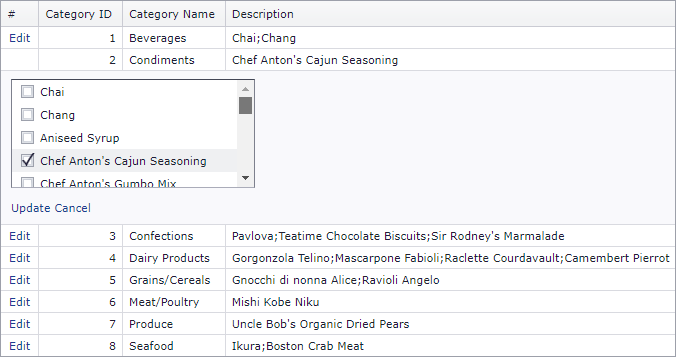

<!-- default badges list -->

<!-- default badges end -->

# Grid View for ASP.NET Web Forms - How to use ASPxListBox to edit grid data inside the grid edit form

This example shows how to use the [ASPxListBox](https://docs.devexpress.com/AspNet/DevExpress.Web.ASPxListBox) control inside the [edit form](https://docs.devexpress.com/AspNet/3710/components/grid-view/concepts/edit-data/edit-form).

## Files to Review

* [Default.aspx](./CS/Default.aspx) (VB: [Default.aspx](./VB/Default.aspx))
* [Default.aspx.cs](./CS/Default.aspx.cs) (VB: [Default.aspx.vb](./VB/Default.aspx.vb))
<!-- feedback -->
## Does this example address your development requirements/objectives?

 

(you will be redirected to DevExpress.com to submit your response)
<!-- feedback end -->
